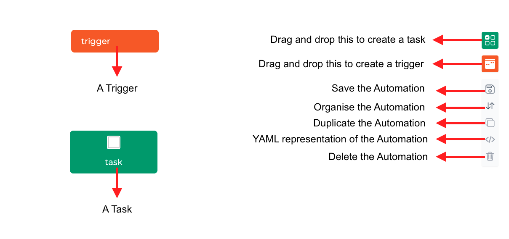
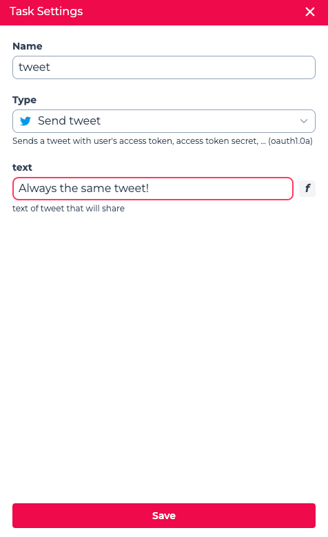
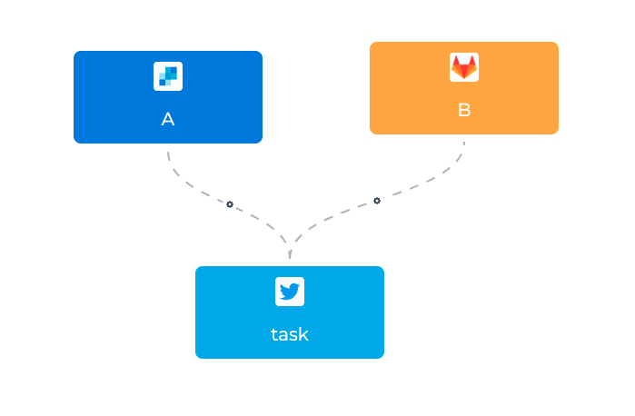
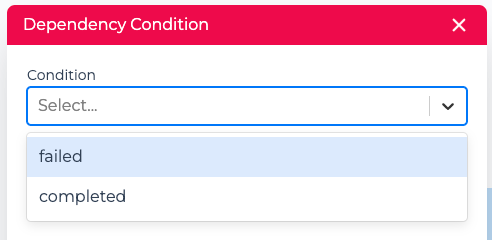
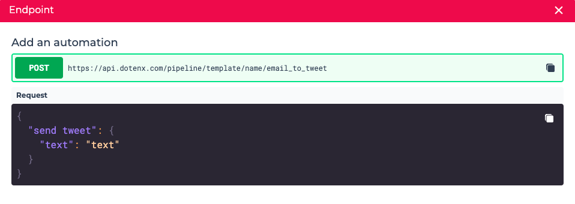

An `Automation Template` is a **template** for an `Automation` which is an automated workflow triggered by an event. For example, you can create an automation for each user, so that whenever they receive an email it's sent to them via Slack. 

Automations are very similar in concept to interactions, however, unlike interactions, automations cannot be used as an API endpoint.

Another conceptual difference between automations and interactions is that, as automations are executed as background jobs, you don't need to be extra cautious about the overall execution time of the entire workflow, however, in an interaction
you are cautious about the execution time of the overall workflow.

Each automation is composed of a `Trigger` and multiple `Tasks` which you can execute in the order you specify in the automation.
The tasks can be configured with the input provided by the user or the output of the preceding tasks. Triggers also can be configured based on the value you provide.
You can use any of the existing tasks or create your own with custom code.

Each automation is executed in a `Session` which is a single execution of the workflow.

## Creating an automation template

To create automations, you have to create an automation template.

To create an `automation template` click the `+ New automation template` button to go to the **Automation Canvas** where you can create workflows running in the background and triggered by the events you specify.

### Automation tasks

An automation can be composed of a single task or multiple tasks. The tasks can depend on other tasks or execute as soon as the automation is triggered.
This means that you **can run multiple tasks in parallel**.

You can add a task to the automation by dragging and dropping it to the canvas and you can delete it by right-clicking on the task and clicking on the delete option.

When you add a task to the automation, you can select the type of the task and based on that you can configure the task.

In the above example, you can see the task of type "Send tweet" accepts only a single value, `text` which is the text of the tweet. You can set a value for field which will always be used when this task is executed in this automation, or in the more likely case, you can leave it blank to set it value dynamically when you want to create this automation. It's also possible to set a value for some attributes of the tasks and leave some of them blank.

### Dependency between the tasks

You can create a dependency relation between on task with multiple tasks by connecting them and setting the dependency condition.

In the above image, the tasks **A** and **B** run in parallel as soon as the automation's execution has started and the task **C** starts when both of those tasks
are `completed`.

In order to set the condition of dependency, click on the cog on the link between two tasks and select the the condition as follow:
- `failed`: the preceding task should fail to run this task
- `completed`: the preceding task should complete successfully to run this task

## Creating an automation

An automation is an instance of an automation template. You don't design each automation individually, but you can or should adjust them according to each case or user you're creating the automation for.

In the list of the automation templates click on the endpoint to get the details of the HTTP request you should send to create an automation from this template. In the endpoint you automatically get the body of the request based on the blank inputs of the tasks and triggers in the automation template.

### Authorization

All the automation endpoints are `protected`, meaning you have to provide a valid `Authorization` token when calling the endpoint. You get this token in the body of the response of a request to the login endpoint which has been successful. For more details refer to the [User management](../builder_studio/user_management#sign-in) section.

### Integration and Provider

Some tasks or triggers need a `provider` to work. For example, if you want to use the "Send tweet" task, you need a user `integration` which is crated with your Twitter `provider`.
This section will be completed soon.