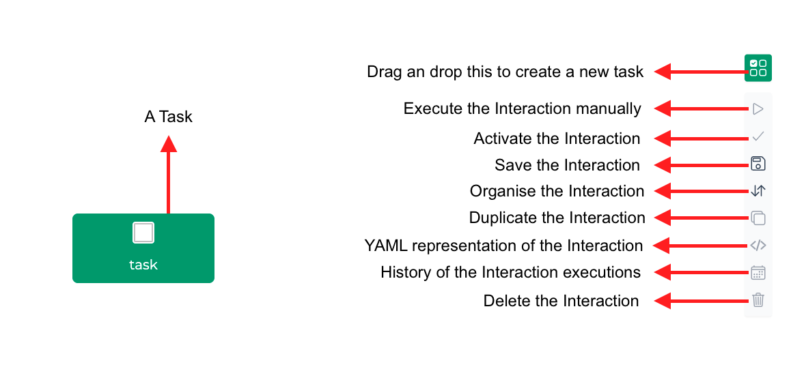
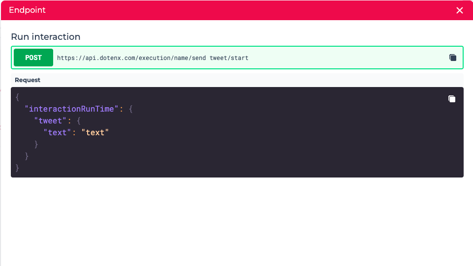

An `Interaction` is a workflow, exposed as an API endpoint, which you can executed though a simple API call. 
Each interaction is composed of multiple `Tasks` which you can execute in the order you specify in the interaction.

The tasks can be configured with the input provided by the user or the output of the preceding tasks.
You can use any of the existing tasks or create your own with custom code.

Each interaction is executed in a `Session` which is a single execution of the workflow.
You can use (call) interactions as API endpoints to execute workflows. 

Worth mentioning, interactions are **massively scalable** and based on your plan, can be called tens of thousands of times per minute!

## Creating an Interaction

To create an `Interaction` click the `+ New Interaction` button to go to the **Interaction Canvas** where you can create workflows you can use as API endpoints.

### Interaction tasks

An Interaction can be comprised of a single task or multiple tasks. The tasks can depend on other tasks or execute as soon as the interaction is executed.
This means that you **can run multiple tasks in parallel** (this feature, if used correctly, gives you a unique performance advantage).

You can add a task to the interaction by dragging and dropping it to the canvas and you can delete it by right-clicking on the task and clicking on the delete option.

When you add a task to the interaction, you can select the type of the task and based on that you can configure the task.

In the above example, you can see the task of type "Send tweet" accepts only a single value, `text` which is the text of the tweet. You can set a value for field which will always be used when this task is executed in this interaction, or in the more likely case, you can leave it blank to set it value dynamically when you want to execute this interaction. It's also possible to set a value for some attributes of the tasks and leave some of them blank.

### Dependency between the tasks

You can create a dependency relation between on task with multiple tasks by connecting them and setting the dependency condition.

In the above image, the tasks **A** and **B** run in parallel as soon as the interaction's execution has started and the task **C** starts when both of those tasks
are `completed`.

In order to set the condition of dependency, click on the cog on the link between two tasks and select the the condition as follow:
- `failed`: the preceding task should fail to run this task
- `completed`: the preceding task should complete successfully to run this task

## Executing an Interaction

Before executing an interaction, make sure it's `activated`.

In the list of the interactions click on the endpoint to get the details of the HTTP request you should send run this interaction. In the endpoint you automatically get the body of the request based on the blank inputs of the tasks in the interaction.

### Authorization

All the interaction endpoints are `protected`, meaning you have to provide a valid `Authorization` token when calling the endpoint. You get this token in the body of the response of a request to the login endpoint which has been successful. For more details refer to the [User management](../builder_studio/user_management#sign-in) section.

### Integration and Provider

Some tasks need a `provider` to work. For example, if you want to use the "Send tweet" task, you need a user `integration` which is crated with your Twitter `provider`.
This section will be completed soon.