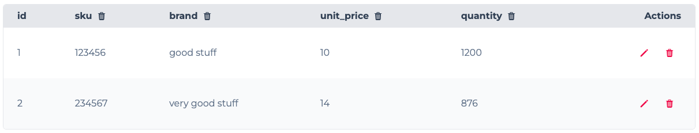
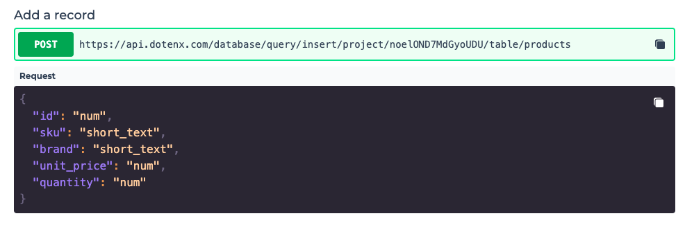
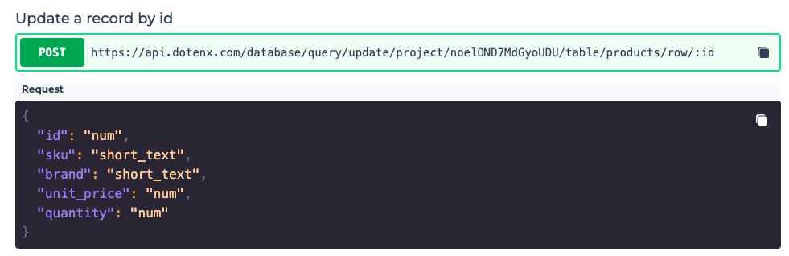
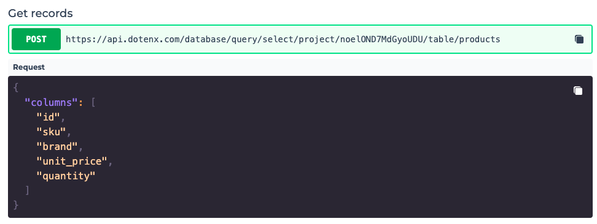
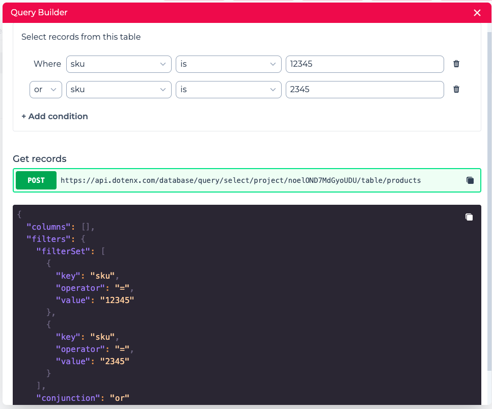

`Tables` are used to store the data of your application. Each table stores data entries in multiple rows, each row comprised of multiple fields.

In the following sections we start by giving an introduction about storing data in tables. If you're already familiar with these concepts you can skip this part.

## Quick intro to tables

A common practice in software development is to store the data in table structured format. A table, is a two dimensional structure, with rows and columns.

Each row corresponds to a single data entry and the columns correspond to the fields or attributes of the entries. For instance, you can represent the products in a table like this:

As you can see each row, shows a single product and each column in the table specifies a single attribute of the product.

## Creating a table
You can create a table on tables page, by clicking on the `+` button. Once the table is created you can click on the table to get access to the table.

When you create a table, initially it doesn't have any data and even any columns. Before starting to use the table, you have to add the columns that best describe the data you want to store into the table.

In order to create a column, click on the `New Column` button. From the dropdown, select the type of column you want to create and enter the name of the column.

The column types are explained below:
- **Yes/No**: use this column type for the attributes with binary values. It's up to you to decide what `Yes` and `No` correspond to.
- **Image address**: use this column type to store the url of an image.
- **File address**: use this column type to store the url of any file.
- **Rating**: use this column type to store the ratings with values from 0 to 10.
- **URL**: use this column type to store any arbitrary URL.
- **Email**: use this column type to store an email address.
- **Time**: use this column type to store time in 24 hours format.
- **Date**: use this column type to store a date.
- **Date time**: use this column type to store a date with time in 24 hours format.
- **Number**: use this column type to store any arbitrary number.
- **Short text**: use this column type to store a text with a maximum of 100 characters.
- **Long text**: use this column type to store a text with a maximum of 20000 characters.
- **Link to table**: use this column type to join two tables. This is explained thoroughly later.

## Deleting a table

You can delete a table, by clicking the `Delete table` button. You should be very cautious when deleting a table, as it deletes all the records in your table and it's not recoverable after confirming the delete.

## Data manipulation

One you add the columns to the table, you can start adding records/rows to your table directly from the same UI or from your web or mobile application.

Using the UI to create a record, update or delete it is pretty straightforward.

**Note**: A general understanding of APIs and API calls is necessary for the next sections.

### Adding rows

In order to add a record to your table, click on the "endpoints" button, to find the API endpoint you have to call to add a record.

You can copy this endpoint and use it send a POST request and add a record. The schema of the body of your request is given to you as well.

### Updating rows

In order to update a record in a table, click on the "endpoints" button, to find the API endpoint you have to call to update a record.

You can copy this endpoint and use it send a POST request and update the record with the specified `id`. The schema of the body of your request is given to you as well.

You should notice that the field `id` cannot be updated.

### Deleting rows

In order to delete a record in a table, click on the "endpoints" button, to find the API endpoint you have to call to delete a record.

You can copy this endpoint and use it send a POST request and update the record with the specified `id`.

### Selecting rows

In order to get all the records your table, click on the "endpoints" button, to find the API endpoint you have to call to get the records.

You can copy this endpoint and use it send a POST request and get the records. The schema of the body of your request is given to you as well.
In the body of the request you can specify which columns you want to retrieve, which has an important positive impact specially in cases the bandwidth is 
limited, like mobile applications.

This endpoint also supports pagination, meaning you can fetch the records page by page.

Note: If you set the `columns` property in the body of your API request to `[]`, you'll get all the columns in the response.

## Query builder

In order to select records from your table based on certain conditions, you can use `Query builder`.

With Query builder you can select the data you need in your application visually with a simple UI which generates the API request for you as you adjust the condition
with the user interface.

You can form the condition as you want and use the API endpoint with the body generated for you to retrieve the rows based on the condition you specified.
