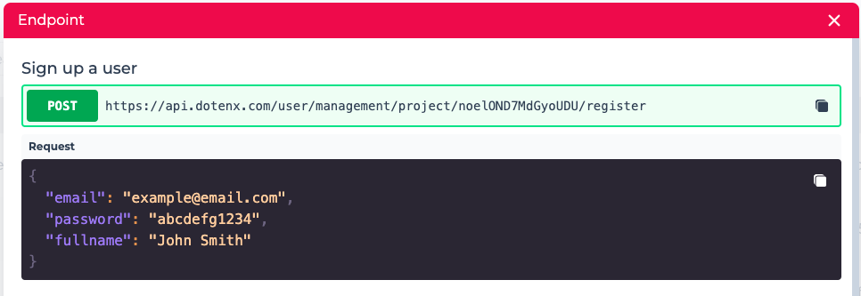
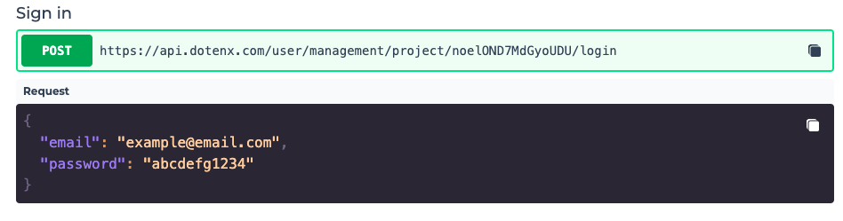
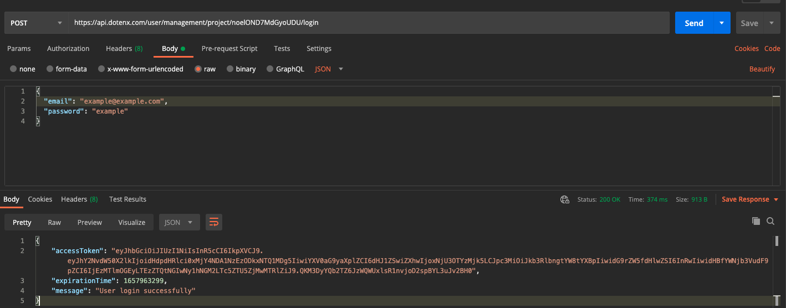
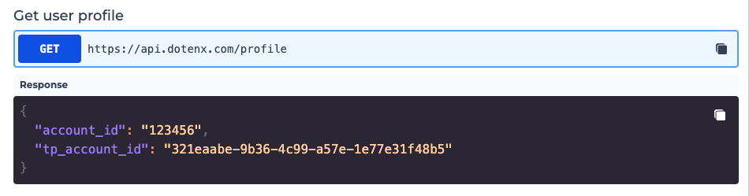

  User management is critical to almost any web or mobile application. The concept of user management and authentication are tightly linked.

  Authentication is the process of verifying the identity of a user. Signing up and signing in are two pillars of authentication.
  You can use the DoTenX `User management` to store and authenticate users without any back-end code.
  
  DoTenX supports two types of authentication:

  - Password authentication
  - OAuth 2.0 authentication with Twitter. Other providers will be supported in the future.

## Password authentication

The most straightforward way to manage the users and authenticate them is using `Password authentication`. 


## Sign up

With password authentication, users sign up by providing a valid, unique email, a password and optionally their full name.
When you add the form to your UI, all you need to is to copy the sign up endpoint and use it in your UI. The body of the request is also provided.


## Sign in

With password authentication, users can sign in by providing their email and password.
When you add the sign in form to your UI, all you need to do is to copy the sign up endpoint and use it in your UI. The body of the request is also provided.



When you send an HTTP request to this endpoint, if the right credentials are provided and the login is successful, in the response of the request you'll be given a token you should use in any further requests you send to the **protected** endpoints (the endpoints which require the user to be authenticated).



As you can see in the above image, in the response body there is a property named `accessToken` which you should extract and usually store for later use in your application. See the example bellow:

```javascript
const response = await axios.post(
  "https://api.dotenx.com/user/management/project/abcdefgh/login",
  {
    email,
    password,
  }
);

localStorage.setItem("accessToken", response.data.accessToken);
```

## User profile

There are times you need to get access to the user's account ID in your application. This usually happens when you want to add data to your tables or read data from them, specifically for certain user.

In order to get the user's account ID you can make an API call which is available to you to copy and use int your application.



## OAuth 2.0 authentication

WIP